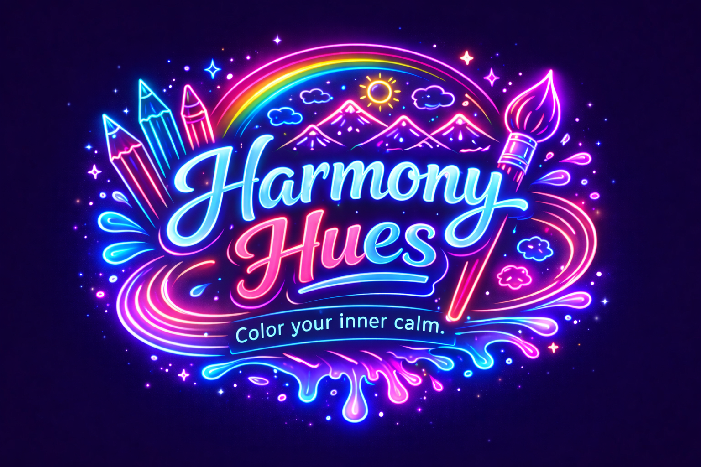

# Harmony Hues

'Color your Inner Calm' 

---

Harmony Hues is a meditative mandala coloring experience designed to blend art, mindfulness, and technology into a single, calming digital space. It is a visually immersive coloring experience designed to transform simple interaction into a moment of mindful creativity. Built around fluid gradients, luminous palettes, and elegantly crafted illustrations, the game invites players to slow down and engage with color as both expression and therapy.

Every canvas is intentionally composed to balance structure with freedom—allowing you to fill intricate outlines or broad abstract forms with carefully chosen tones that respond beautifully against its vibrant neon aesthetic. It is not merely about completing an image; it is about entering a rhythm where hue, contrast, and composition work together in quiet synchronization.

“Symmetry in Every Stroke.”

The word Harmony represents balance, alignment, and peaceful coexistence. Hues represent color, expression, and emotion.

“Feel the Flow of Every Hue.”

Harmony Hues is built with a strong emphasis on artistic integrity and visual balance.

 “Where Art Meets Serenity.” 
 
 “Crafted in Calm, Colored in Harmony.” 
 
“Every Stroke, A Soft Symphony.”

---
Click here to play! [https://jashbhai635.github.io/Harmony-Hues/]

This game is best experienced on itch.io

Tech Stack 

---
© 2026 CodeMatrix Studio. All rights reserved.

